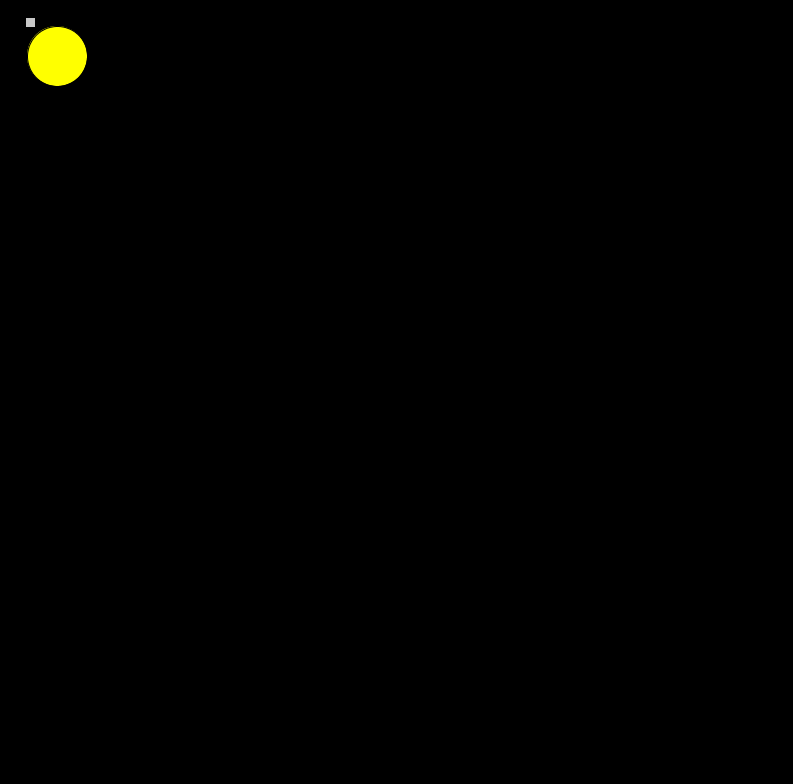

Upload your program into the new folder, with the extension .pde. Your program should be well commented and organized. If you use any variables, chose good names.
Upload a screenshot of your portrait into the new folder
Create a README.md in the new folder and include your screenshot in the README.md.
Describe what the environment is supposed to be and why it is important to you
Write a short description of any difficulties you had or anything interesting you discovered.

This is a picture of how the game will look like once you have started (the game seems to not want to have a lot of bugs so for the time being one asteroid is all that can currently be seen).

This is supposed to be a simple game of defense against asteroids which are trying to destroy a base and you need to protect the base by clicking on the asteroids before they hit the base. The asteroids also have different health values and each time they are clicked, the health values will drop by 1 (this could later be modified to be a special amount.

While programming this, I had difficulties with a few things. First of all the structure of whether to include a function within a body of a class as a method or to include it as a function outside of the class was confusing but I ultimately decided on where to put them based on whether they would ever need to be accessed outside of the body of the class or not. 

I also found I had a lot more bugs than expected and spent more time than I had budget for this assignment. I may have tried to do too much but after a few hours of attempting to debug the code and find where I had problems, I am still stuck. For the time being all that can be displayed is a single asteroid and the base. The problem that I had was originally with the data type being used and it took me a decent amount of research before realizing that the position of objects needed to be in float values rather than int values as I had thought originally. After this I ran into another problem with where values needed to be within a class as I tried having some values within methods but didn't understand how to have those values communicated between methods. This was fixed with the change in having class wide values that could be updated within methods. Before I had time to attempt to implement text related information I wanted to have the motion of my asteroids completed as well as the ability to create the base. However, I had a hard time displaying the base and tried to find the problem. Without a solution found I attempted to look display a singular asteroid and that worked. I realized that for some reason a function constantly returned true instead of false. This has become a problem that I have spent a lot of time on but unfortunately have not figured out the solution to. This also means I haven't been able to complete my project.

I found it really interesting to work with classes and I can see how they would be very beneficial as in my use case of creating multiple asteroids. This made programming each asteroid less difficult to do.
