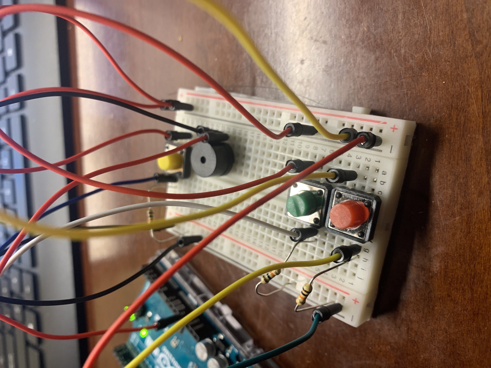
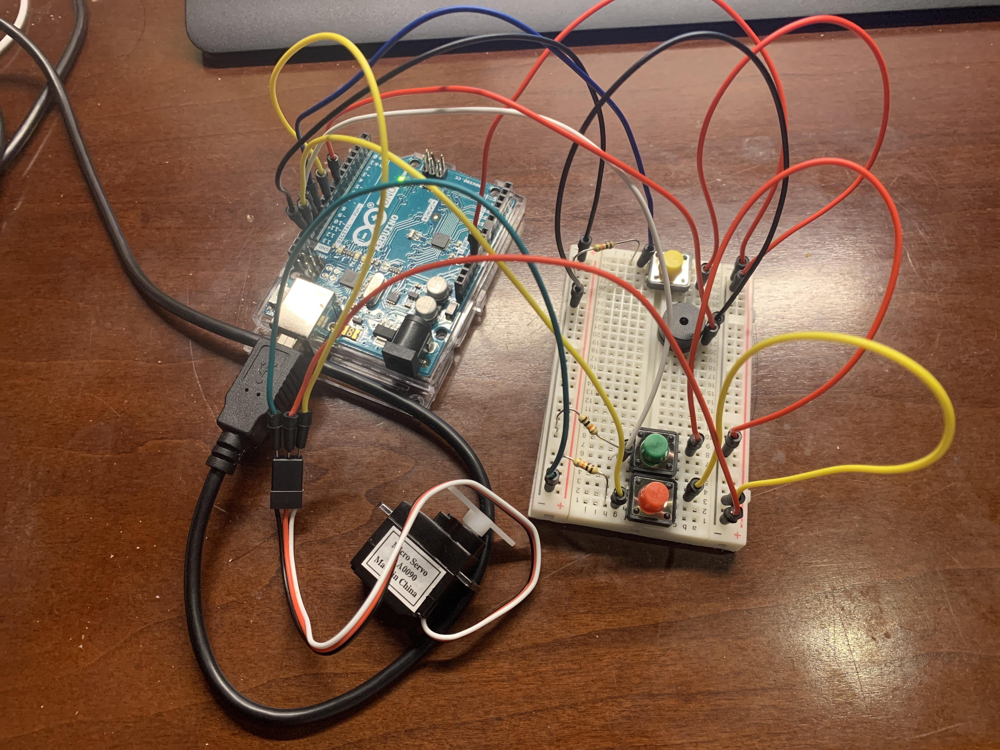

**Description of project**

This project aimed at making an integrated metronome that would play constantly with adjustable speeds with an auto plucker that could be used on a guitar. The idea was that it woulbe able to pluck multiple different string based instruments including a tisue box with rubberbands wrapped around it. The plucker would be used with a push of a button.

**Anything clever or tricky**

I had used an incrementing value of 1.6 times the metronome speed to increase and .625 to decrease the metronome rate. This provided the cleanest decimal point values. I also spent a decent amount of time making the functions which I think worked out to implement my project quite well.

**Problems (if any) and how you overcame them**
I have been having problems largely with compiling the program because for some reason some varaibles don't want to be declared recieving error messages about the variable titles not working. For some of the cases I realized I was using a java based problem which was making new objects from my classes with the new keyword when this was not necessary in C++ for arduino. I also had problems trying to make the plucker properly work because I thought that I should have the motor spin as quickly as I could get it to.

**Schematic**

**Link to short video of the instrument being played**

https://youtu.be/EwJ-vV7CoPA

**Photograph of the instrument**

**Closeup photographs of the electronics**

