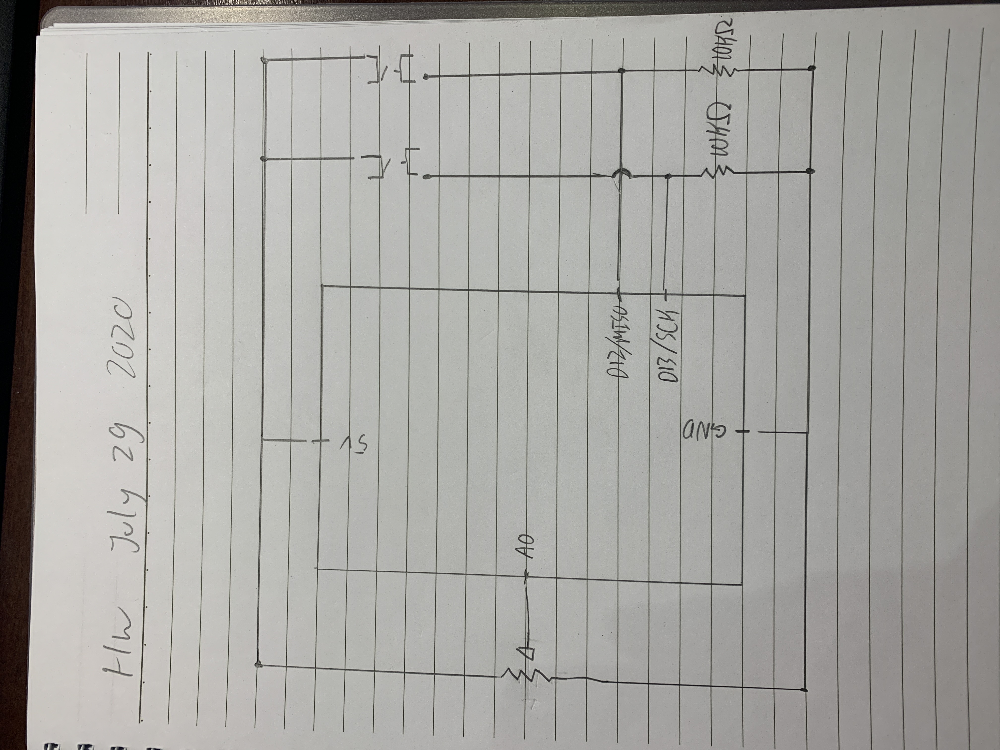
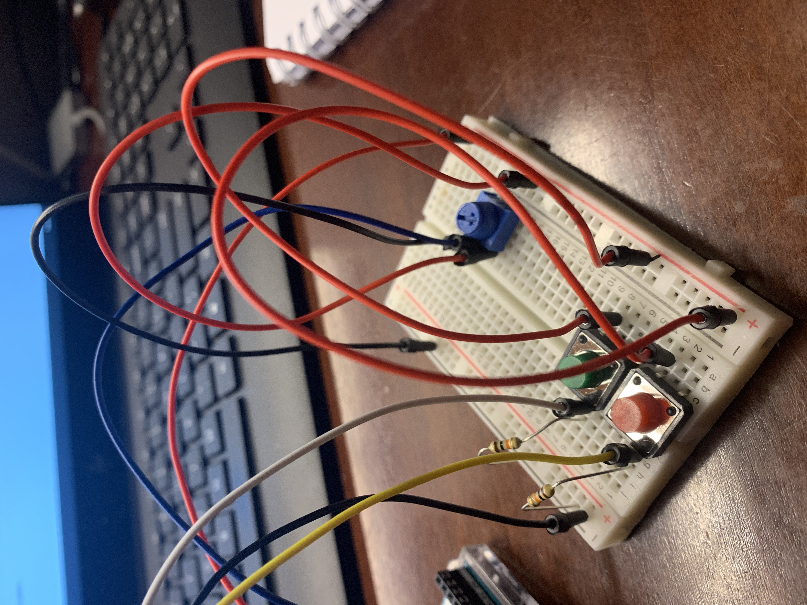
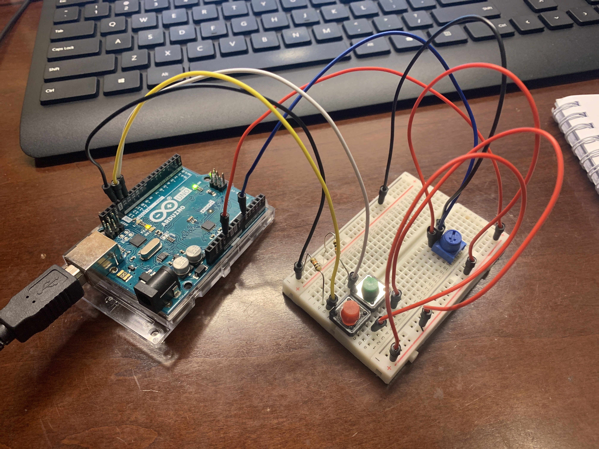

**Description of project**

I attempted to make a difficulty dial using the potentiometer which would impact the size of the enemy. This makes them easier/harder to click and makes the gameplay more interesting. I also included a couple quality of life improvements in terms of bug fixes and I am attempting to implement a pause and play button.

**Anything clever or tricky**

I set up the program to run from universal variables so if I were to change the value of that variable it would not need to be changed within each line of code. This is more emphasized with the method of implementing the integration of size control on the enemies with the potentiometer. Previously the enemies only had one size, however, I set a variable to be called the currentEnemySize to be called each time the draw function was called. This allowed for it to be updated by the serial port that provided information by the Arduino. It did not take too many changes from the original code to get it working as I used processing's search capabilities to replace and find all instances of enemySize in the enemy class and modify it to the universal currentEnemySize. Ultimately the reason this needed to be done was because there needed to be a range within the Max and Min size of the enemy could be set to allow a mapping function to work. I thought that the structure of my code (and the concept of OOP) was well emphasized here.

**Problems (if any) and how you overcame them**

At first I was a bit confused about how to communicate between the Arduino and the processing code. However, I had referenced a lot of the class examples and the notes that I took during class to be able to implement what I wanted to do. One problem I had, which left me stumped for awhile, was typing in the wrong port for the potentiometer. Originally in my test on the circuit I made, the potentiometer was reading out correctly, but in my game the code couldn't compile because of an arrayOutOfBounds exception. It did not highlight where this exception occured however. After some thought and carefully coming through some of my code, I realized that I had mistyped my port in processing, indexing into port 5 instead of port 4 (the former of which did not exist). After ammending this, I was able to get the Arduino to communicate and control my program.

**Schematic**

**Link to short video of the game being played**

When I went to record something seems to have gone wrong with my project and it no longer communicates with the arduino

**Closeup photographs of the electronics**

