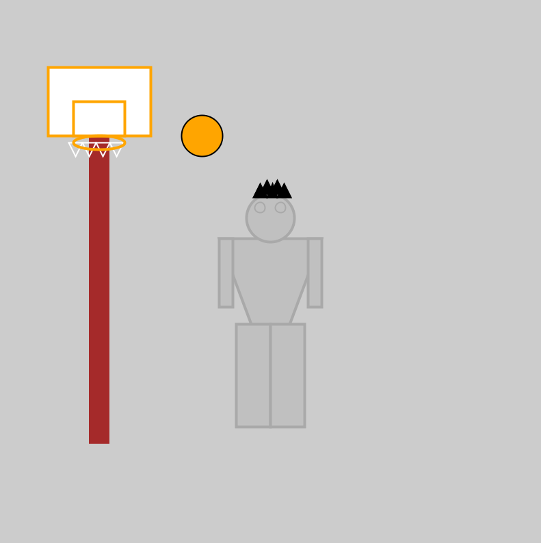

# DES INV 23 HW01

This is my HW submission for July 8th

Screenshot of my beautiful artwork:

Now I am no artist but I was showing a picture of myself playing basketball. I chose the silver and dark grey of the San Antonio Spurs, my favorite basketball team. I used to play a lot of basketball before coming to Berkeley so this was representative of my life in the past and how I met a lot of people that I know now. 

While making this I found that visualizing the co-ordinates in my head was somewhat troublesome and often especially when making triangles, I would end up flipping the x/y co-ordinates and found some interestingly stretched shapes. It became clear that noting down and drawing kind of what I had visualized helped, noting where center points were so that making calculations was relatively easier. I also found that the layering that came with making different shapes was prioritized for the most recent (or bottom most) element. As a result I did find myself copy pasting shapes I made until they were in the order I desired. I did try some animation but still found it confusing so decided to leave it out. The hope was to make it look like the basketball was being shot towards the basket.

On a side note, having less to do with the actual programming and more to do with github and the submission process, I found that for some reason saving early in the .pde file lead to it saying it was an empty file. I did have the file saved in a different folder than the suggested Sketchbook folder but the fix I found was saving the file as a new document (thus creating a new folder wherever I re-saved the file) and then uploading that file. This leads me to question where saves are stored when I press ctrl+'s'. I haven't spent enough time looking into this but this just was a side not that I thought could be important for myself and possibly others who are new to Processing.
