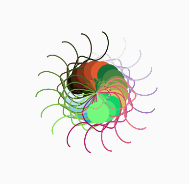

I have attached my Artwork below!

My Inspiration was the mesmerizing rainbow collored pin wheels that I remember seeing a lot of growing up. On top of that, I wanted to do a somewhat hypnotic counterclockwise color rotation to make opposing rotation visible and adding some different depth.

I set most of it to draw a new shape at specifically set times and then had it render these drawings.

I ran into some difficulties figuring out the timings and rotation but looked back to lecture to see how it was achieved there. I also looked at fixing the backwards rotation by using a negative sign.

I thought it was really interesting how it took dynamic information such as mousePresses and FrameTimes into considerations and it is something I hope to implement more of
