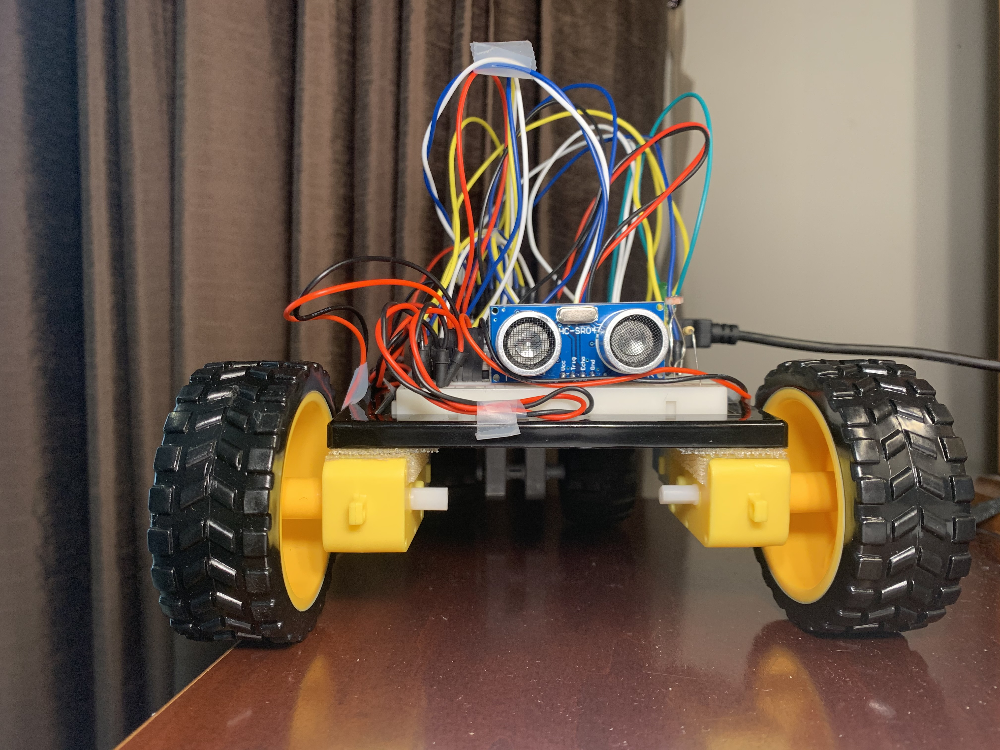
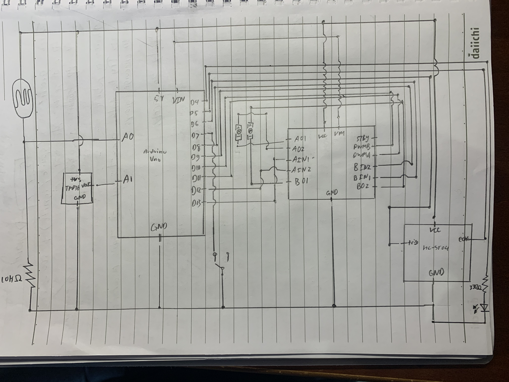
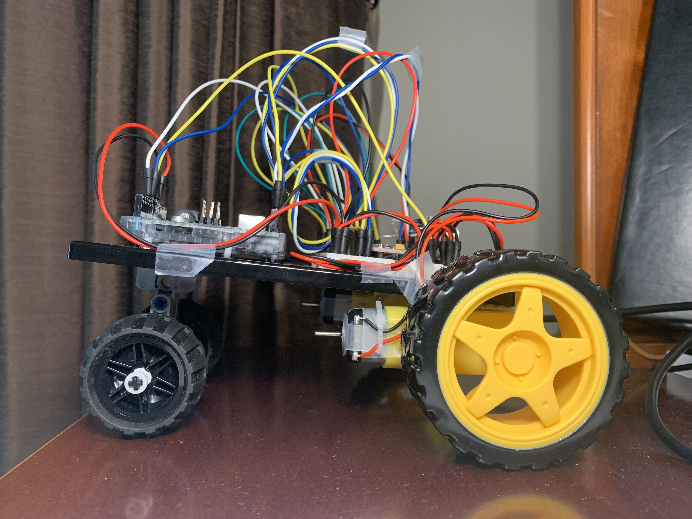
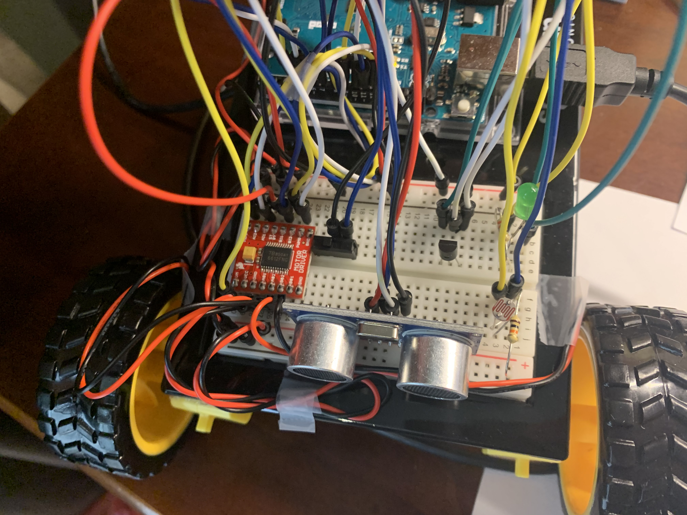
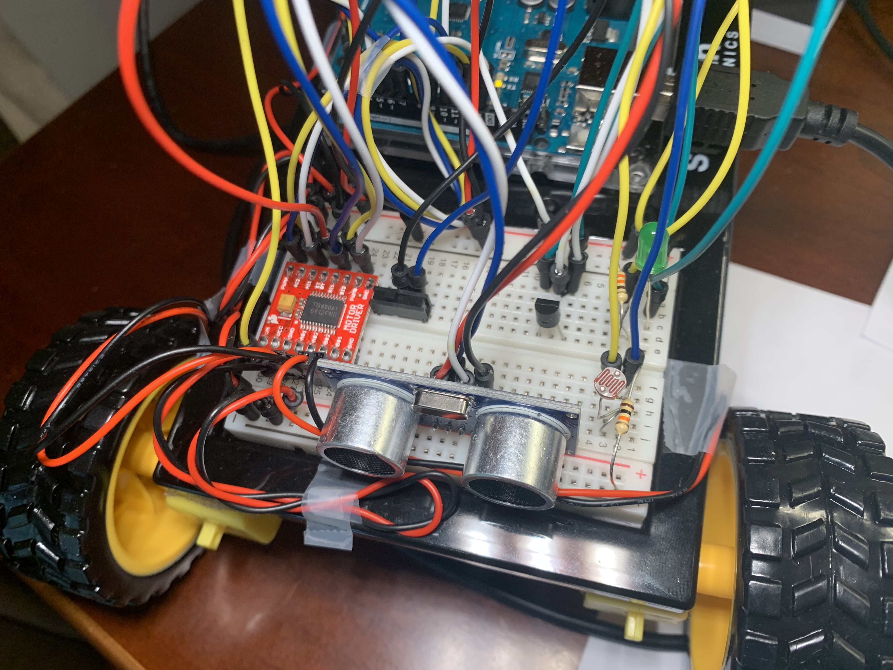
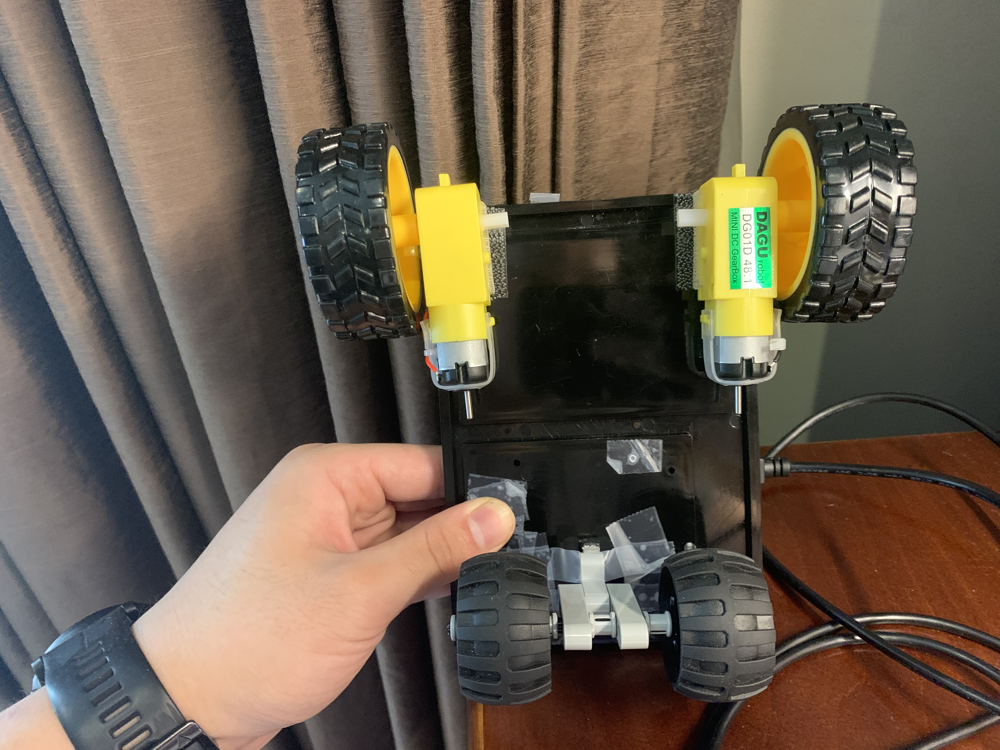
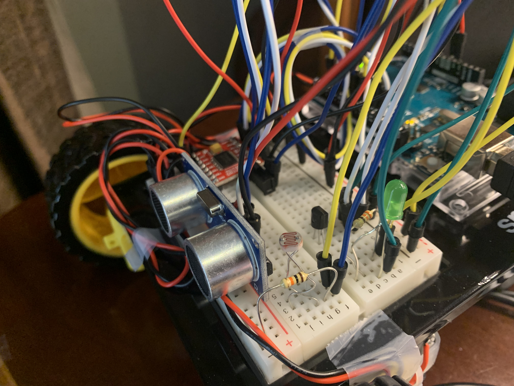

**Project Picture!**

*See more pictures below*

**About the Project**

This project was my final project for the Design Innovation 23 class. The goal was to create a visualizer that utilized information from the three sensors on board the arduino and communicate their values to create artwork in Processing. The end result was a mobile robot that automatically mapped your room and provide feedback visually with a 3D model of cubes made of cubes.

**Problems and how you overcame them**

This is a lot of the problems that I ran into on the hardware side. To get access to more of the progress documentation, visit the google drive link below.

On the software side a problem I had was with the serial communication. There would be times when the initial bytes of information that was being communicated was a NaN and it would not want to be handled. My solution while not elegant was to create a time buffer before accepting any data which was in the form of a wait function and value. This allowed for me to only run code when it had already recieved a few inputs allowing the sensors some time to properly communicate.

**Clever and Tricky issues/solutions**

I am proud of some of the features I implemented on the hardware side. One was the fact that the arduino would sometimes be taken off to be used and messed around with made it difficult to just screw it in, set it and forget it. So instead, I used the stems of q-tips and used them as stand-offs to keep it in place while the rest of it just slid on to there so it could be easy to put on and take off. I have documentation of this in the later referenced google drive link if you would like to see.

**Schematic**

**Photographs of the project and close ups of the electronics**

**Link to the video**

https://youtu.be/ZStyUsbO5Ws

