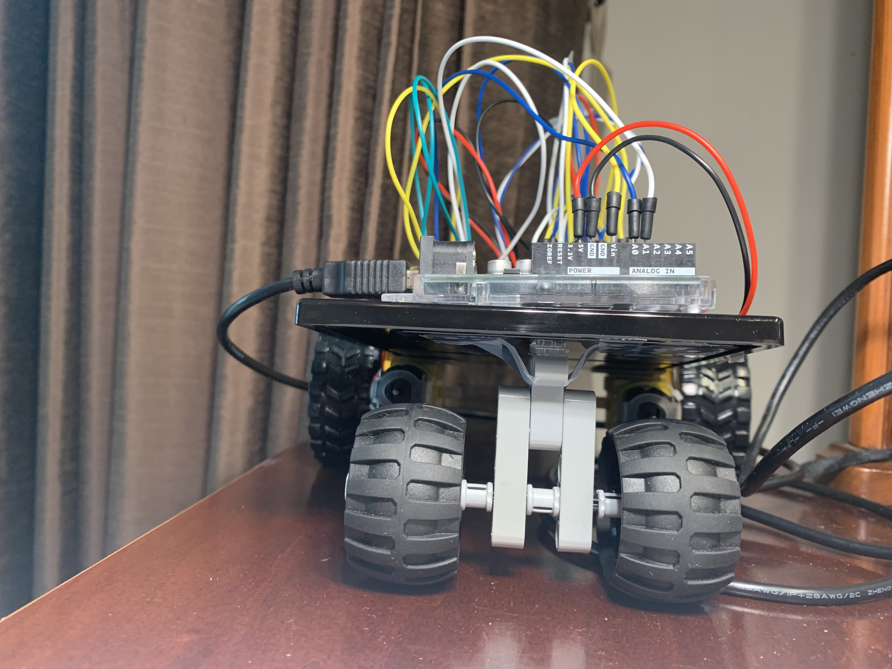

**VISUALIZE YOUR LIFE ROBOT**

**Project Picture!**

*See more pictures below*

**About the Project**

This project was my final project for the Design Innovation 23 class. The goal was to create a visualizer that utilized information from the three sensors on board the arduino and communicate their values to create artwork in Processing. The end result was a mobile robot that automatically mapped your room and provide feedback visually with a 3D model of cubes made of cubes. This was achieved by first making the robot able to interact with its environment and the be able to communicate the information from the sensors into processing. I then sent these values and information over to processing via a serial port and in real-time you could see how the movement and inputs of the robot and its sensors led to a visual experience. For a better understanding the referenced youtube video I made is a good place to start.

The three sensors were a photoresistor, ultrasonic sensor, and temperature sensor. These impacted the positioning of the 3D lighting, the scale of the model relative to the viewer, and the color of the model respectively. To make the visual experience even more dynamic. I set values to change over time based on the inputs from the ardunio so that for example, the color change would be easier to see (as too much variation in the values would make a stagnant color profile). If you would like to know more and have read through this document please feel free to reach out to me!

**Problems and how you overcame them**

This is a lot of the problems that I ran into on the hardware side. To get access to more of the progress documentation, visit the google drive link below.

On the software side a problem I had was with the serial communication. There would be times when the initial bytes of information that was being communicated was a NaN and it would not want to be handled. My solution while not elegant was to create a time buffer before accepting any data which was in the form of a wait function and value. This allowed for me to only run code when it had already recieved a few inputs allowing the sensors some time to properly communicate.

**Clever and Tricky issues/solutions**

I am proud of some of the features I implemented on the hardware side. One was the fact that the arduino would sometimes be taken off to be used and messed around with made it difficult to just screw it in, set it and forget it. So instead, I used the stems of q-tips and used them as stand-offs to keep it in place while the rest of it just slid on to there so it could be easy to put on and take off. I have documentation of this in the later referenced google drive link if you would like to see.

**Schematic**

**Photographs of the project and close ups of the electronics**

**Link to the video**

https://youtu.be/ZStyUsbO5Ws

**Google Drive link for progress documentation**
https://drive.google.com/drive/folders/1zqv21iMCAdXKXT1f92I83NaoF0eVflSG?usp=sharing

*you need a berkeley email for access, if you don't have access to such email just let me know and I would love to give you access!*
